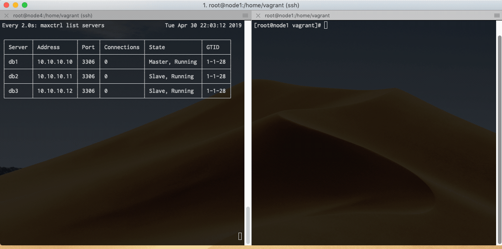

# MariaDB Standard Replication Ansible Playbook
### 1 MaxScale Node, 1 Master Node, 2 Slave Nodes ###

#### About

This automation project will use [Vagrant](https://www.vagrantup.com/downloads.html) to create 4 virtual servers using [Virtualbox](https://www.virtualbox.org/wiki/Downloads).

After completing the "Setup" instructions below, you will have a 4 node MariaDB cluster with 1 master, 2 slaves and a Maxscale database proxy.

This will give you a local environment to experiment with MaxScale and automated failover.

If you have your own environment and would like to skip the virtualbox portion, you can just edit the inventory/hosts file and begin with **step 5**.

*(Tested with both [centos/7](https://app.vagrantup.com/centos/boxes/7) and [bento/ubuntu-18.04](https://app.vagrantup.com/ubuntu/boxes/bionic64) Vagrant boxes)*

#### Prerequisites

* [Git](https://git-scm.com/download/)
* [Vagrant](https://www.vagrantup.com/downloads.html)
* [Virtualbox](https://www.virtualbox.org/wiki/Downloads)
* [Ansible](http://docs.ansible.com/ansible/latest/intro_installation.html)

#### Setup

1. `git clone https://github.com/toddstoffel/standard_replication.git`
1. `cd standard_replication`
1. `vagrant plugin install vagrant-vbguest`
1. `vagrant up`
1. `ansible-playbook provision.yml`

#### MariaDB Node Access

* To access db1: `vagrant ssh node1`
* To access db2: `vagrant ssh node2`
* To access db3: `vagrant ssh node3`

#### MaxScale Node Access

* To access mx1: `vagrant ssh node4`

#### Testing It

*The terminal screen on the left is running `watch maxctrl list servers`*

*The terminal screen on the right is running a graceful stop and start of MariaDB on the master (node1)*.

#### Notes

By default this project uses Centos 7. If you would like to use another distro, please edit the following file:

* [Vagrantfile](Vagrantfile)

The Ansible playbook is designed to be OS agnostic and should not require altering. However, further customization can be performed by editing these files:

* [inventory/hosts](inventory/hosts)
* [inventory/group_vars/all.yml](inventory/group_vars/all.yml)  <-- Verify your ethernet interface. This can change with different Linux distros.

####  Clean Up

* `vagrant destroy --force`
